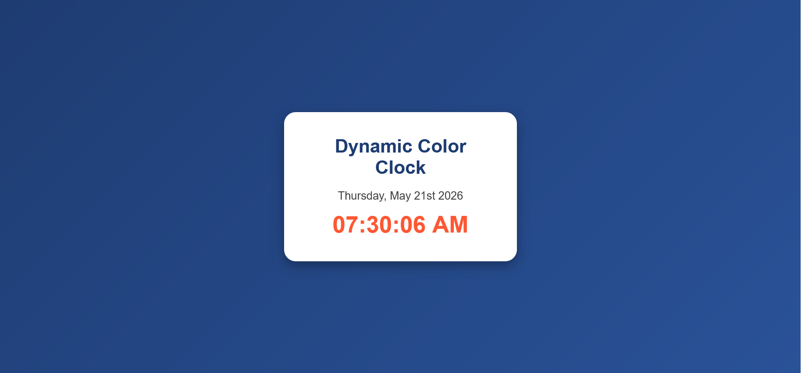

#  Dynamic Color Clock

A modern, responsive **real-time digital clock application** built using **React, Vite, and date-fns**.  
This project demonstrates core frontend development skills including React hooks, component-based architecture, state management, and clean UI design.

---


##  Live Preview


---


## About the Project

The **Dynamic Color Clock** is a simple yet powerful React application that displays the current date and time in real time.  
The clock updates every second and presents the time in a clean, readable format.

It was built as part of a frontend development lab focusing on:
- React project structure
- npm package usage
- UI styling
- real-time state updates

---

##  Features

- ⏱ Real-time clock updates every second
- 📅 Displays formatted current date
- 🎨 Modern UI with gradient background
- ⚛️ Built using React functional components
- 🔁 Uses React Hooks (`useState`, `useEffect`)
- 📦 Uses `date-fns` for date formatting
- 📱 Responsive and clean layout

---

##  Tech Stack

- React
- Vite
- JavaScript (ES6+)
- CSS3
- date-fns

---

## Project Structure

```
color-clock/
│
├── public/
├── src/
│   ├── App.jsx
│   ├── index.css
│   ├── main.jsx
│
├── screenshot.png
├── package.json
├── vite.config.js
└── README.md
```

---

## Installation & Setup

To run this project locally, follow these steps:

### 1. Clone the repository
```bash
git clone https://github.com/123Mwanjira/color-clock.git
```

### 2. Navigate into the project
```bash
cd color-clock
```

### 3. Install dependencies
```bash
npm install
```

### 4. Install date-fns
```bash
npm install date-fns@2.30.0
```

### 5. Run the development server
```bash
npm run dev
```

Then open:
```
http://localhost:5173/
```

---

##  Preview

The application displays:
- A styled card layout
- Current date in readable format
- Live updating digital clock
- Smooth, modern UI design

---

##  What I Learned

- How to create a React project using Vite
- How to use React Hooks effectively
- How to manage real-time state updates
- How to use external npm libraries (`date-fns`)
- How to structure a clean frontend project
- How to use Git & GitHub for version control

---

## 👨 Author

**Maurine   Wanjira**

---

##  Notes

This project was developed as a learning exercise in React fundamentals and frontend UI design.  
It demonstrates practical use of modern React development practices.

---

##  Future Improvements

- Add dark/light mode toggle
- Add multiple time zones
- Add animation effects
- Add customizable themes
```

---

